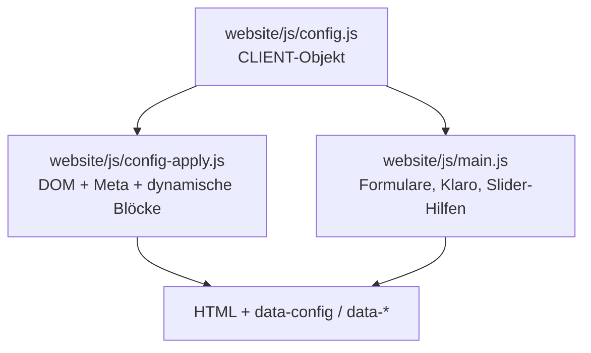
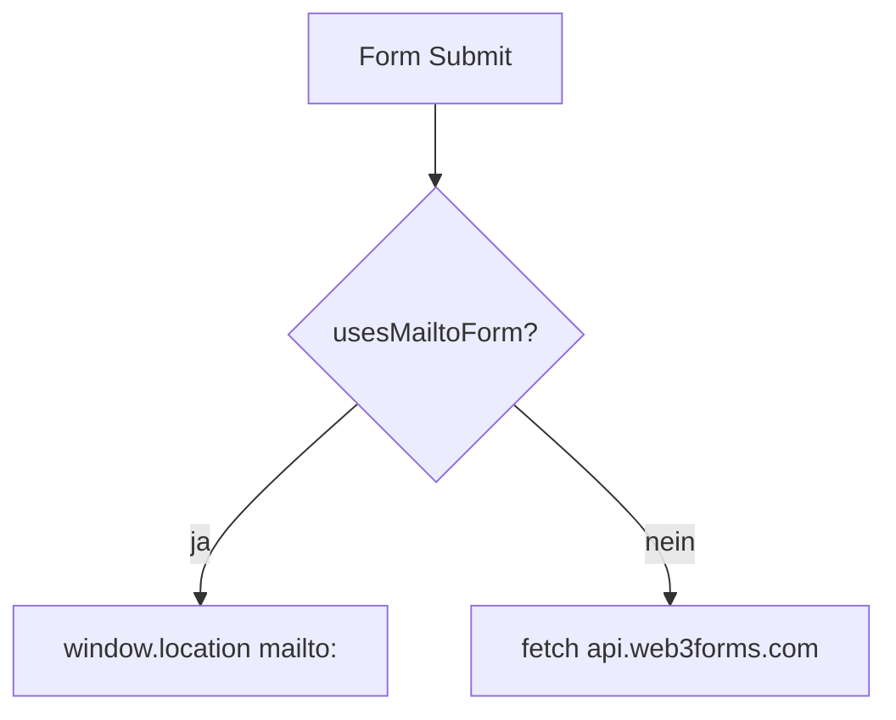

# TEMPLATE-STRUKTUR — Handwerker-Website (RAIS)

> **Stand:** 2026-06-03 · Sync aus Produktions-Demo (Schmitt-Struktur)  
> **Zweck:** Referenz für alle künftigen Handwerker-Projekte. Neuer Kunde = Ordner duplizieren → `config.js` + Bilder + wenige HTML-Stellen.

---

## 1. Architektur



| Schicht | Datei | Aufgabe |
|---------|-------|---------|
| Daten | `config.js` | **Einzige Pflicht** für Kundentexte, URLs, Varianten |
| Bindung | `config-apply.js` | `data-config`, `data-config-href`, `renderFaq()`, `renderPartners()`, Termin-Toggle |
| Interaktion | `main.js` | Mailto/Web3Forms, FAQ-Akkordeon (ein offen), Karte, Klaro |
| Präsentation | `style.css`, `variables.css` | Layout, Grid, Marquee, Akkordeon |

**Platzhalter-Konvention:** Werte mit `[...]` werden von `config-apply.js` **nicht** ins DOM geschrieben (leer lassen bis ausgefüllt).

---

## 2. Repository-Layout

```
Vorlage_Handwerker_Webseite/
├── TEMPLATE-STRUKTUR.md      ← Dieses Dokument
├── CLAUDE.md                 ← KI-Kontext + Regeln
├── SETUP.md                  ← Kunden-Onboarding
├── vercel.json               ← outputDirectory: "website"
├── scripts/
│   ├── fetch-partner-logos.js
│   ├── validate-jsonld.js
│   ├── smoke-test.js
│   └── check-images.js
└── website/
    ├── index.html
    ├── referenzen.html, team.html, impressum.html, datenschutz.html, 404.html
    ├── leistungen/
    │   ├── innenarbeiten.html
    │   ├── fassade.html
    │   ├── bodenbelaege.html
    │   └── schimmelbeseitigung.html
    ├── partials/nav-snippet.html   (Referenz, nicht deployen)
    ├── js/  config.js, config-apply.js, main.js, slider.js, calc.js, pdf.js
    ├── css/ variables.css, style.css, animations.css
    ├── images/  (+ partner/, README)
    ├── business-profile.json, llms.txt, robots.txt, sitemap.xml
    └── templates/pdf-kalkulation.html
```

---

## 3. Sektionen-Reihenfolge (`index.html`)

| # | ID | Inhalt |
|---|-----|--------|
| — | `header` / `#mainNav` | Logo, Nav inkl. **Leistungen-Dropdown**, CTA „Rückruf anfordern“ |
| 1 | `#hero` | Video, zentriertes Logo, Firmenname + Slogan, 2 CTAs (Rückruf + Telefon), Credentials, Scroll |
| 2 | `#vorher-nachher` | Slider (`slider.js`, Sets in `imageSets`) |
| 3 | `#leistungen` | 4 Karten → Unterseiten |
| 4 | `#kostenrechner` | Optional (`kostenrechnerAktiv`) |
| 5 | `#warum` | 4 USPs + Bild |
| 6 | `#familie` | Über uns (`ueberUns[]`) |
| 7 | `#referenzen` | Grid `ref_1` … |
| 8 | `#partner` | Marquee `[data-partner-track]` |
| 9 | `#bewertungen` | Demo-Platzhalter → vor Go-Live echte Google-Texte |
| 10 | `#termin` | Termin-Variante (siehe §5) |
| 11 | `#kontakt` | Info + Karte + **FAQ** + Formular (siehe §6) |
| — | `footer` | NAP, Leistungen, Legal |

**Entfernt gegenüber alter Vorlage:** eigene `#faq`-Sektion (FAQ lebt in `#kontakt`), Trust-Strip als eigene Sektion (Credentials im Hero).

---

## 4. HTML-Datenattribute (Katalog)

| Attribut | Element | Steuerung |
|----------|---------|-----------|
| `data-config="feld"` | Text-Inhalt aus `CLIENT.feld` | config-apply §3 |
| `data-config-href="tel"` | `tel:`, `mailto:`, `whatsapp`, `calcom`, Social | config-apply §4 |
| `data-termin="rueckruf\|calcom\|whatsapp\|formular"` | Termin-Blöcke | `CLIENT.terminVariante` |
| `data-datenschutz-termin="…"` | Listeneinträge Datenschutz | gleiche Variante |
| `data-faq-list` | Leerer Container → `<details class="faq-item">` | `CLIENT.faq[]` |
| `data-partner-track` | Partner-Marquee (Index: voll) | `CLIENT.partner[]` |
| `data-partner-compact` | Kompaktes Marquee (Unterseiten) | gleich |
| `data-wa-wrap` | WhatsApp-Zeile Kontakt | nur wenn `CLIENT.whatsapp` |
| `data-nav-calc` | Nav-Link Kostenrechner | `kostenrechnerAktiv` |

---

## 5. Termin-Varianten

**Default Vorlage:** `terminVariante: "rueckruf"`, `formularModus: "mailto"`

| Variante | UI | Go-Live |
|----------|-----|---------|
| `rueckruf` | Anrufen, WhatsApp, `#rueckrufForm` → mailto | Demo ohne Cal.com |
| `calcom` | Consent-Gate + Cal.com-Link | `calcomLink` + Klaro |
| `whatsapp` | Großer WA-Button | `whatsapp` Nummer |
| `formular` | `#terminForm` → Web3Forms | `web3formsKey` |

Cal.com- und Formular-Blöcke bleiben im DOM mit `hidden`, bis Variante gewechselt wird.

---

## 6. Kontakt-Grid

```text
Desktop (.kontakt-inner):
  grid-template-areas:
    "info map"
    "faq  form"

Mobile:
  info → map → faq → form
```

- **FAQ:** `id="faq"` am Block `.kontakt-faq` (Anker für Schema/Links)
- **Formular:** Web3Forms-Action; bis Key gesetzt → mailto via `main.js` + `formularModus`

---

## 7. Partner-Karussell

```js
partner: [
  { name: "…", url: "https://…", logo: "partner/datei.png" },
  { name: "…", url: "", logo: "" }  // Text-Badge
],
partnerIntro: "…",
partnerBgColor: "var(--secondary-dark, #1c1a14)"
```

- Logos unter `website/images/partner/`
- `renderPartners()` dupliziert Track für Endlos-Marquee
- Skript: `node scripts/fetch-partner-logos.js` (Domains im Skript anpassen)

---

## 8. Formular-Flows



**`usesMailtoForm()` true wenn:** `formularModus === "mailto"` ODER `web3formsKey` leer/Platzhalter.

Betrifft: `#kontaktForm`, `#rueckrufForm`, `#terminForm`.

---

## 9. Navigation

- **Desktop:** Dropdown „Leistungen“ → 4 Unterseiten + Anker `#leistungen`
- **Mobile:** `<details class="nav__mobile-group">` mit gleichen Links
- **Pfade:** `partials/nav-snippet.html` dokumentiert Varianten `root` | `leistungen` | `root-sub`

---

## 10. Neuer Kunde — Checkliste (~30 Min Kern)

1. Ordner `Vorlage_Handwerker_Webseite` kopieren, umbenennen
2. **`website/js/config.js`** — alle `[PLACEHOLDER]` ersetzen
3. **`website/css/variables.css`** — Farben (oder `CLIENT.colors`)
4. **`website/images/`** — Pflichtdateien laut `images/README.md`
5. **`index.html`** — 5× Google-Bewertungen (optional, wenn nicht generisch)
6. **`terminVariante` / `formularModus`** für Go-Live setzen
7. `sitemap.xml`, `robots.txt`, `llms.txt`, `business-profile.json` — Domain ersetzen
8. `node scripts/validate-jsonld.js` + `node scripts/smoke-test.js`

---

## 11. Diff: Was in der Vorlage bewusst anonym ist

| Bereich | Vorlage | Kunden-Demo |
|---------|---------|-------------|
| `config.js` | `[FIRMENNAME]`, `[ORT]`, … | Echte NAP-Daten |
| Partner-URLs | 3 Beispiel-Slots | Live-Partnerliste |
| Bilder | SVG-Platzhalter | JPG/WebP/MP4 |
| Bewertungen | Hinweistexte | Echte Google-Zitate |
| `klaroStorageName` | `[KUNDE]-consent-v1` | z. B. `schmitt-consent-v1` |
| Slider | `.svg` | optional `.jpg` |

---

## 12. Verifikation

```bash
cd Vorlage_Handwerker_Webseite
node scripts/validate-jsonld.js
cd website && npx serve -l 4173 .
# zweites Terminal:
node scripts/smoke-test.js
```

---

## 13. Verwandte Docs

- [`SETUP.md`](SETUP.md) — Schritt-für-Schritt Kundengespräch
- [`CLAUDE.md`](CLAUDE.md) — Brand/Design für KI
- [`sop-webseiten-bau/03-seitenstruktur.md`](sop-webseiten-bau/03-seitenstruktur.md) — Sitemap-Übersicht
